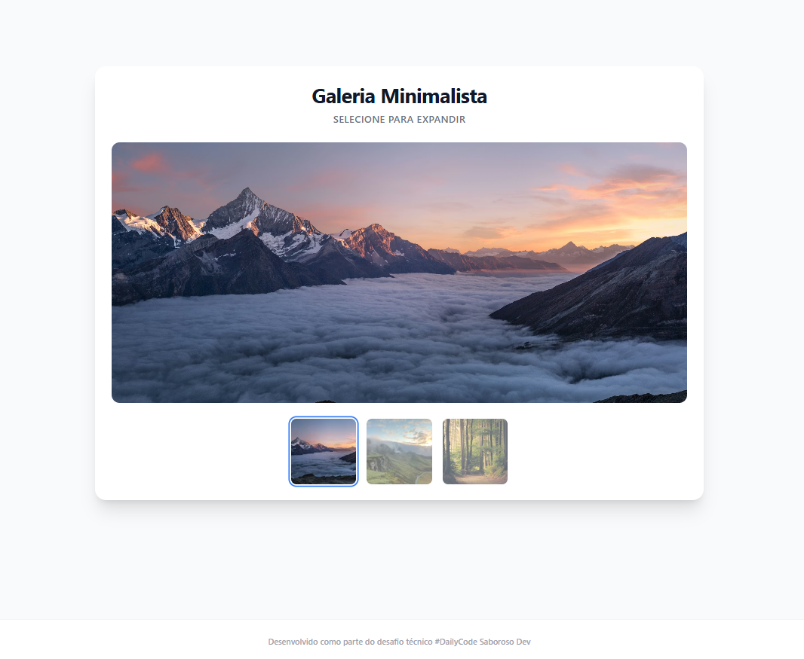

# 🖼️ Galeria Minimalista



## 🔗 [Clique aqui para ver o Demo Online](https://seu-usuario.github.io/nome-do-repositorio)

## 📋 Sobre o Projeto

Uma galeria de imagens interativa e responsiva desenvolvida com foco na elegância visual e na experiência do usuário. O objetivo foi criar um componente onde a imagem de destaque é atualizada dinamicamente ao clicar nas miniaturas, 

## 🚀 Tecnologias Utilizadas

* **HTML5 Semântico**: Estrutura acessível e organizada.
* **Tailwind CSS (CDN)**: Estilização utilitária para um design system rápido e consistente.
* **JavaScript (ES6+)**: Lógica de manipulação do DOM e eventos.

## ✨ Funcionalidades

* **Troca Dinâmica de Imagem**: Atualização do `src` principal baseada em atributos `data-*`.
* **Transições Suaves (Fade-in/out)**: Uso de `setTimeout` e classes de opacidade para criar uma experiência fluida.
* **Feedback Visual**: Indicadores claros de qual miniatura está ativa (bordas, opacidade).

## 🧠 Destaques de Implementação

### 1. Atributos de Dados (Data Attributes)
Para manter o HTML limpo e separar os dados da visualização, a URL da imagem de alta resolução é armazenada em um atributo customizado:

```html

```

## 🛠️ Como Executar

Simplesmente clone o repositório e abra o arquivo `index.html` no seu navegador. Não é necessário instalação de dependências via npm, pois o projeto utiliza CDNs para máxima portabilidade.

```bash
# Clone o repositório
git clone ## 🛠️ Como Executar

Simplesmente clone o repositório e abra o arquivo `index.html` no seu navegador. Não é necessário instalação de dependências via npm, pois o projeto utiliza CDNs para máxima portabilidade.

```bash
# Clone o repositório
git clone https://github.com/Alicia-Alexia/galeria_miniaturas

# Entre na pasta
cd galeria_miniaturas

# Abra o index.html (ou use uma extensão como Live Server)
```

## 📂 Estrutura de Arquivos

A estrutura foi pensada para projetos estáticos, mantendo a raiz limpa e os recursos organizados:

/galeria_miniaturas

    │
    ├── assets/              <-- Pasta principal de recursos
    │   ├── js/              <-- Pasta específica para Scripts
    │   │   └── script.js
    │   │
    │   │
    │   └── img/ 
    |        └── image.png     
    │
    ├── index.html           
    └── README.md         <-- Documentação


## 🤝 Autor
Desenvolvido por Alicia como parte de estudos em Frontend Development.
